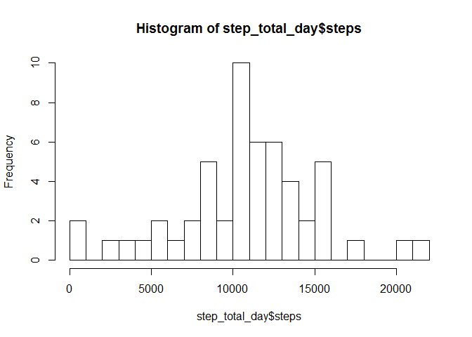
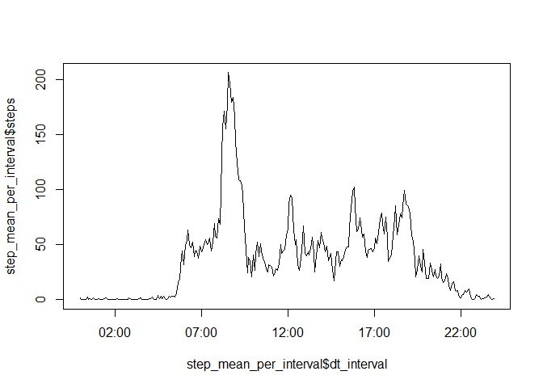
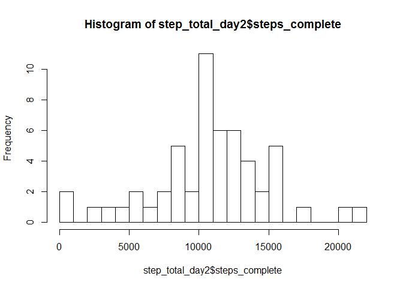
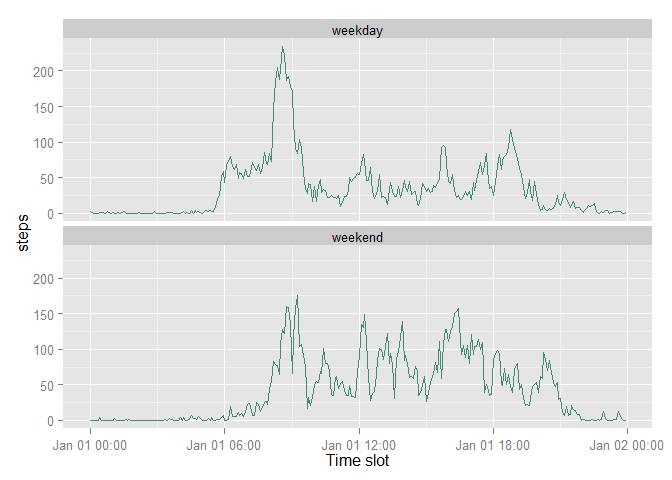

# Reproducible Research: Peer Assessment 1

## Load the required packages
This report uses the following packages
- lubridate
- ggplot2
The assumption is made that these packages are installed before running this script


```r
library(lubridate)
library(ggplot2)
```


## Loading and preprocessing the data
- unzip the file with the source data
- read the csv data to object "a"

```r
unzip("activity.zip")
a <- read.csv("activity.csv")
```

### Conversion
- convert date *string* to *datetime*
- convert the interval to datetime to assure correct display in graph
(nb: see this forum thread for why you cannot just print the "interval"
https://class.coursera.org/repdata-012/forum/thread?thread_id=36)

```r
a$date <- as.Date(a$date)
a$dt_interval <- parse_date_time(sprintf("%04d", a$interval), orders="hm")
```

## What is mean total number of steps taken per day?

For this part of the assignment, you can ignore the missing values in the dataset.
Calculate the total number of steps taken per day

Calculate and report the mean and median of the total number of steps taken per day

Calculate the total per day using 'aggregate', and

```r
step_total_day <- aggregate( formula = steps~date, 
           data = a,
           FUN = sum )
```
.. make histogram of total number of steps taken each day

```r
hist(step_total_day$steps, breaks = 30)
```

 

Calculate the mean and the median of the daily total number of steps

```r
mean(step_total_day$steps)
```

```
## [1] 10766.19
```

```r
median(step_total_day$steps)
```

```
## [1] 10765
```


## What is the average daily activity pattern?
Make a time series plot (i.e. type = "l") of the 5-minute interval (x-axis) and the average number of steps taken, averaged across all days (y-axis)


```r
# aggregate the original set by dt_interval and calculate the mean of steps
step_mean_per_interval <- aggregate(steps ~ dt_interval, data = a, mean)
# plot a line graph of the mean steps per interval
plot(step_mean_per_interval$dt_interval, step_mean_per_interval$steps, type="l")
```

 

Which 5-minute interval, on average across all the days in the dataset, contains the maximum number of steps?


```r
# get the max number of steps
m_steps <- max(step_mean_per_interval$steps)
# get the interval during which the max number of steps occurred
t_max_steps <- step_mean_per_interval$dt_interval[which.max( step_mean_per_interval[,"steps"])]
# report
sprintf("Maximum mean number of steps is %s during interval starting at %s:%s", round(m_steps), hour(t_max_steps), minute(t_max_steps)) 
```

```
## [1] "Maximum mean number of steps is 206 during interval starting at 8:35"
```


## Imputing missing values

a) Calculate and report the total number of missing values in the dataset (i.e. the total number of rows with NA s)


```r
# calculate the number of rows where steps = NA
sum(is.na(a$steps))
```

```
## [1] 2304
```

b) Devise a strategy for filling in all of the missing values in the dataset. 

**imputation strategy for missing data:** *fill in the missing step values by looking up the mean step value for the same interval as that from the previously calculated step_mean_per_interval data set*

c) Create a new dataset that is equal to the original dataset but with the missing data filled in.

```r
# create a copy of the original data set
a2 <- a


# replace steps_complete by lookup from step_mean_per_interval where steps = NA
a2$steps_complete <-ifelse(is.na(a2$steps),
                      step_mean_per_interval[which(step_mean_per_interval$dt_interval==a2$dt_interval),"steps"], 
                      a2$steps)
```

d) Make a histogram of the total number of steps taken each day and calculate and report the mean and median total number of steps taken per day. Do these values differ from the estimates from the first part of the assignment? What is the impact of imputing missing data on the estimates of the total daily number of step

Aggregate to total per day (using aggregate) and make histogram of total number of steps taken each day


```r
step_total_day2 <- aggregate( formula = steps_complete~date, 
           data = a2,
           FUN = sum )

hist(step_total_day2$steps_complete, breaks = 30)
```

 

calculate and report the mean and median total number of steps taken per day.


```r
mean(step_total_day2$steps_complete)
```

```
## [1] 10766.19
```

```r
median(step_total_day2$steps_complete)
```

```
## [1] 10765.59
```
Do these values differ from the estimates from the first part of the assignment? What is the impact of imputing missing data on the estimates of the total daily number of step:

**conclusion:** *replacing missing values (NA) by the mean number of steps for the interval does not affect the mean but has an impact on the median number of steps per day.*


## Are there differences in activity patterns between weekdays and weekends?

a) Create a new factor variable in the dataset with two levels - "weekday" and "weekend" indicating whether a given date is a weekday or weekend day.

Using lubridate wday function (that returns 1 for Sunday and 7 for Saturday) mark the days as "weekday" or "weekend" in new variable "daytype"


```r
a2$daytype <- as.factor( ifelse(wday(a2$date) %in% c(1,7),"weekend", "weekday" ) )
```

b) Make a panel plot containing a time series plot (i.e. type = "l" ) of the 5 minute interval (x axis) an dthe average number of steps taken, averaged across all weekday days or weekend days (y axis)


```r
# calculate the interval mean based on the completed data set
step_mean_per_interval2 <- aggregate(steps ~ daytype + dt_interval, data = a2, mean)

# use ggplot to print two separate graphs by "daytype"
p <- ggplot(step_mean_per_interval2, aes( x=dt_interval, y=steps ))
p <- p + geom_line(color="aquamarine4") 
p <- p + facet_wrap(~daytype, nrow=2)
p <- p + xlab("Time slot") 
# print plot
p
```

 
**conclusion:**
*During weekends the activity starts later in the morning (8 AM vs 6 AM) and there is, on average, more activity during the day.*
